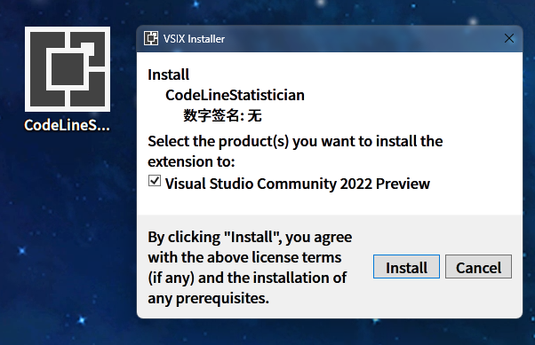
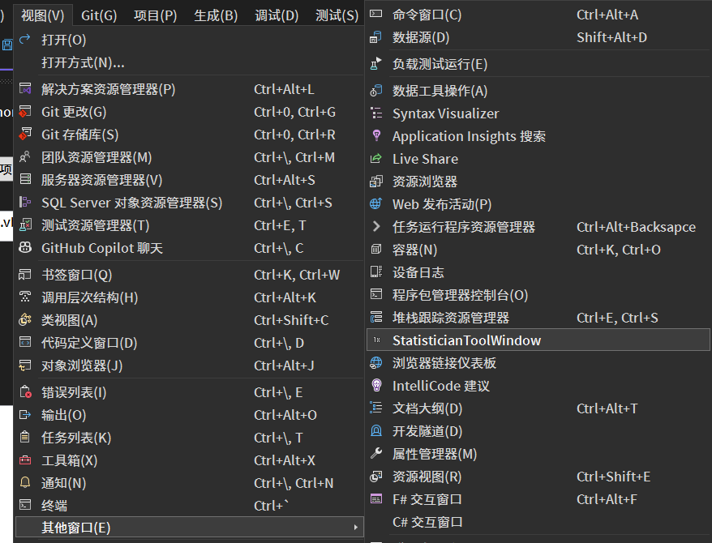
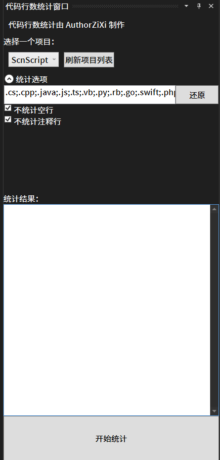

# CodeLineStatistican
这是一个统计代码行数的扩展

工作在Visual Studio 2022上

## 使用教程

1. 安装扩展

2. 在“视图”菜单找到“其他窗口”，打开“StatisticianToolWindow”

3. 这是个统计工具窗口

4. 点击“刷新项目列表”，选择一个项目
5. 这里也可以调整设置，比如统计的文件扩展名、是否统计空行、注释行等
6. 点击“统计”按钮，即可统计当前项目的代码行数
7. 在统计结果中，可以看到具体每个文件的代码行数

>	注意：本工具没有排除统计多行注释的功能
>
>	不同的编程语言，注释的规则不同，本工具没有考虑这些规则，全部排除//和#开头的行
>
>	不过大部分常用场景下，//和#开头的行都是单行注释，所以本工具可以满足大部分需求